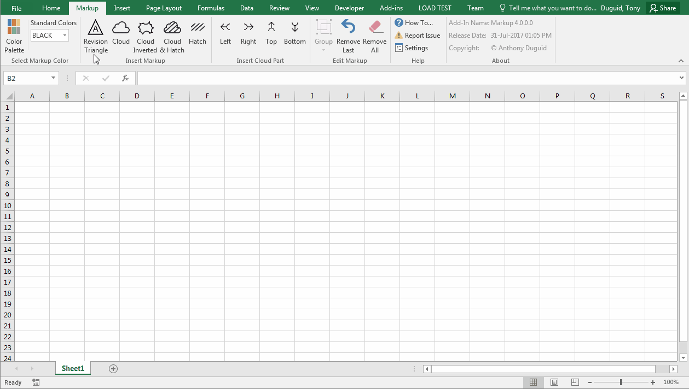
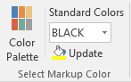
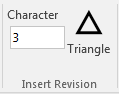
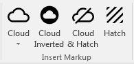
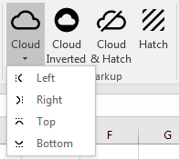
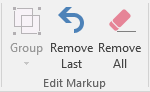
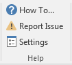
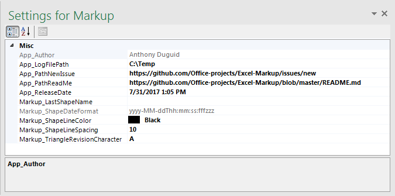
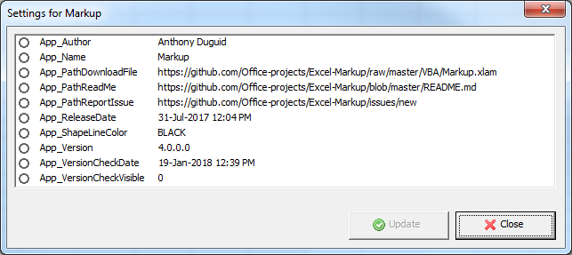
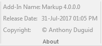

This Add-In is used for marking up Excel files with revisions.
There are two common methods of indicating where a revision has changed a drawing that contains a system diagram. The first is the cloud method, were each change is enclosed by a cloud shape.  The second method involves placing a triangle with the revision number next to each effected portion of the drawing.  The cloud method indicates changes from the most recent revision only, whereas the second method indicates all revisions to the drawing because all of the previous revision circles remain on the drawing.

[](https://www.paypal.me/AnthonyDuguid/1.00)
[](LICENSE "MIT License Copyright © Anthony Duguid")
[](https://github.com/Office-projects/Excel-Markup/releases)
[](https://github.com/Office-projects/Excel-Markup)

The most complete version is C#. 
<a href="https://github.com/Office-projects/Excel-Markup/issues" target="_blank">
 
</a>

<h1 align="left">
  
</h1>

<br>

## Table of Contents
- <a href="#install">Install</a>
- <a href="#dependencies">Dependencies</a>
- <a href="#glossary-of-terms">Glossary of Terms</a>
- <a href="#functionality">Functionality</a> 
    - <a href="#select-markup-color">Select Markup Color</a>
    - <a href="#insert-revision">Insert Revision</a>
    - <a href="#insert-markup">Insert Markup</a>
    - <a href="#insert-cloud-part">Insert Cloud Part</a>
    - <a href="#edit-markup">Edit Markup</a>
    - <a href="#help">Help</a>
    - <a href="#about">About</a>

<br>

<a id="user-content-install" class="anchor" href="#install" aria-hidden="true"> </a>
## Install
Instructions for installation of VBA and VSTO versions.

### VBA
How to install the VBA version
1. Download the VBA Add-In file [](https://github.com/Office-projects/Excel-Markup/raw/master/VBA/Markup.xlam?raw=true "Download the VBA Add-In").
2. Copy the file to the XLSTART folder on your computer. ```%AppData%\Microsoft\Excel\XLSTART\```
3. Close all open instances of Excel and then launch Excel. The new ribbon should appear.

### VSTO
How to install the VSTO version
1. Download AnthonyDuguid.pfx And Install At Root Level [](https://github.com/Office-projects/Excel-Markup/blob/master/CS/AnthonyDuguid.pfx?raw=true "Download AnthonyDuguid.pfx And Install At Root Level For VSTO")
2. Download and run the setup.exe file. [](https://github.com/Office-projects/Excel-Markup/blob/master/CS/publish/setup.exe?raw=true "Download Setup.exe Install File")

<br>

<a id="user-content-dependencies" class="anchor" href="#dependencies" aria-hidden="true"> </a>
## Dependencies
|Software                                   |Dependency                 |Project                    |
|:------------------------------------------|:--------------------------|:--------------------------|
|[Microsoft Visual Studio Community 2017](https://www.visualstudio.com/vs/whatsnew/)|Solution|VSTO|
|[Microsoft Office Developer Tools](https://visualstudio.microsoft.com/vs/features/office-tools/)|Solution|VSTO|
|[Microsoft Excel 2010 (or later)](https://www.microsoft.com/en-au/software-download/office)|Project|VBA, VSTO|
|[Visual Basic for Applications](https://msdn.microsoft.com/en-us/vba/vba-language-reference)|Code|VBA|
|[Extensible Markup Language (XML)](https://www.rondebruin.nl/win/s2/win001.htm)|Ribbon|VBA, VSTO|
|[Log4Net](https://www.nuget.org/packages/log4net/) |Error Logging |VSTO|
|[ScreenToGif](http://www.screentogif.com/)|Read Me|VBA, VSTO|
|[Snagit](http://discover.techsmith.com/snagit-non-brand-desktop/?gclid=CNzQiOTO09UCFVoFKgod9EIB3g)|Read Me|VBA, VSTO|
|Badges ([Library](https://shields.io/), [Custom](https://rozaxe.github.io/factory/), [Star/Fork](http://githubbadges.com))|Read Me|VBA, VSTO|

<!---|[Sandcastle](https://github.com/EWSoftware/SHFB)|API Documentation|VSTO|--->
<br>

<a id="user-content-glossary-of-terms" class="anchor" href="#glossary-of-terms" aria-hidden="true"> </a>
## Glossary of Terms

| Term                      | Meaning                                                                                  |
|:--------------------------|:-----------------------------------------------------------------------------------------|
| COM |Component Object Model (COM) is a binary-interface standard for software components introduced by Microsoft in 1993. It is used to enable inter-process communication and dynamic object creation in a large range of programming languages. COM is the basis for several other Microsoft technologies and frameworks, including OLE, OLE Automation, ActiveX, COM+, DCOM, the Windows shell, DirectX, UMDF and Windows Runtime.  |
| Cloud |Refers to the joined arcs that make up a shape|
| Hatch |The use of fine, parallel lines drawn closely together, often rapidly drawn, to create the illusion of shade or texture|
| VBA |Visual Basic for Applications (VBA) is an implementation of Microsoft's event-driven programming language Visual Basic 6 and uses the Visual Basic Runtime Library. However, VBA code normally can only run within a host application, rather than as a standalone program. VBA can, however, control one application from another using OLE Automation. VBA can use, but not create, ActiveX/COM DLLs, and later versions add support for class modules.|
| VSTO |Visual Studio Tools for Office (VSTO) is a set of development tools available in the form of a Visual Studio add-in (project templates) and a runtime that allows Microsoft Office 2003 and later versions of Office applications to host the .NET Framework Common Language Runtime (CLR) to expose their functionality via .NET.|
| XML|Extensible Markup Language (XML) is a markup language that defines a set of rules for encoding documents in a format that is both human-readable and machine-readable.The design goals of XML emphasize simplicity, generality, and usability across the Internet. It is a textual data format with strong support via Unicode for different human languages. Although the design of XML focuses on documents, the language is widely used for the representation of arbitrary data structures such as those used in web services.|
<body>

<br>

<a id="user-content-functionality" class="anchor" href="#functionality" aria-hidden="true"> </a>
## Functionality
This Excel ribbon is inserted after the “Home” tab when Excel opens. Listed below is the detailed functionality of this application and its components.  

<a id="user-content-select-markup-color" class="anchor" href="#select-markup-color" aria-hidden="true"> </a>
###	Select Markup Color (Group)
<h1 align="left">
  
</h1>

#### Color Palette (Button)
* Select a color for the Markup shapes

#### Standard Colors (Dropdown)
* Select a standard color for the Markup shapes from the list

#### Update (Button)
* Update the color for the selected shapes

<a id="user-content-insert-revision" class="anchor" href="#insert-revision" aria-hidden="true"> </a>
###	Insert Revision (Group)
<h1 align="left">
  
</h1>

#### Character (Textbox)
* This character will appear in the middle of the triangle

#### Triangle (Button)
* Insert a revision triangle in the area of the selected cell(s)

<a id="user-content-insert-markup" class="anchor" href="#insert-markup" aria-hidden="true"> </a>
###	Insert Markup (Group)
<h1 align="left">
  
</h1>

#### Cloud (Button)
* Insert a cloud in the area of the selected cell(s)

#### Cloud Inverted (Button)
* Insert an inverted cloud in the area of the selected cell(s)

#### Cloud & Hatch (Button)
* Insert a cloud with hatching in the area of the selected cell(s)

#### Hatch (Button)
* Insert hatching in the area of the selected cell(s)

<a id="user-content-insert-cloud-part" class="anchor" href="#insert-cloud-part" aria-hidden="true"> </a>
###	Insert Cloud Part (Group)
<h1 align="left">
  
</h1>

#### Left (Button)
* Insert a cloud part on the Left of the selected cell(s)

#### Right (Button)
* Insert a cloud part on the Right of the selected cell(s)

#### Top (Button)
* Insert a cloud part on the Top of the selected cell(s)

#### Bottom (Button)
* Insert a cloud part on the Bottom of the selected cell(s)

<a id="user-content-edit-markup" class="anchor" href="#edit-markup" aria-hidden="true"> </a>
###	Edit Markup (Group)
<h1 align="left">
  
</h1>

#### Group (Menu)
* Join objects together to move and format them as if they were a single object

#### Remove Last (Button)
* Remove the last shape created

#### Remove All (Button)
* Remove all Markup shapes from the active worksheet


<a id="user-content-help" class="anchor" href="#help" aria-hidden="true"> </a>
###	Help (Group)
<h1 align="left">
  
</h1>

#### How To… (Button)
* Opens a webpage of the read me documentation

#### Report Issue (Button)
* Opens a page to create a new issue for the product

#### Add-In Settings (Button)

<kbd>
VSTO
<br>
  
</kbd>

- Types of VSTO Settings
  - Application Settings
    - These settings can only be changed in the project and need to be redeployed
    - They will appear disabled in the form
  - User Settings
    - These settings can be changed by the end-user
    - They will appear enabled in the form
    
<kbd>
VBA
<br>
  
</kbd>

- VBA Settings
  - To add a new setting
    ```vbnet
    ThisWorkbook.CustomDocumentProperties.Add _
    Name:="App_ReleaseDate" _
    , LinkToContent:=False _
    , Type:=msoPropertyTypeDate _
    , Value:="31-Jul-2017 1:05pm"
    ```
  - To update a setting
    ```vbnet
    ThisWorkbook.CustomDocumentProperties.Item("App_ReleaseDate").Value = "31-Jul-2017 1:05pm"
    ```
  - To delete a setting
    ```vbnet
    ThisWorkbook.CustomDocumentProperties.Item("App_ReleaseDate").Delete
    ```

<a id="user-content-about" class="anchor" href="#about" aria-hidden="true"> </a>
###	About (Group)
<h1 align="left">
  
</h1>

#### Add-in Name (Label)
* The application name with the version

#### Release Date (Label)
* The release date of the application

#### Copyright (Label)
* The author’s name
